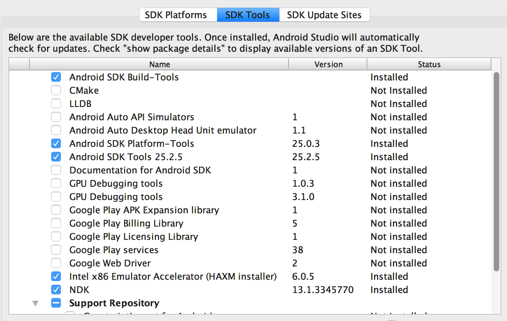

Caffe2 is powering some of the coolest advances in mobile applications, especially for the camera. In this recent announcement of Messenger's updated camera features, many of the effects, including the style transfer can be attributed to Caffe2.

[](https://youtu.be/SnqzXaXnIDw "Facebook's New Camera")

## Prerequisites

Install your IDE of choice or be prepared to build manually. Below we provide instructions for building with [Android Studio](#).

## Object Detection

In this example we are going show very fast object detection that can be used after an image is taken or in real-time while the camera is in its viewer mode. We will use a pre-trained model that was built from a database of 100 objects. We will also show how it is possible to switch out this model for one that is trained to detect 1000 objects, providing more breadth of detection at a cost of a larger size of the model that resides on the phone. Detection time can suffer a little as well, so as you work on your own models you will want to analyze the tradeoffs of accuracy, range, size, and speed. The name of the object will be shown along with the probability result - how much the model believes the object matches with the similar object that was in its training dataset.

The datasets are here:

* [1000 image dataset](#)
* [100 image dataset](#)

## Image Size

Keep in mind that as part of the processing for Caffe2, images should be square, so that even if the camera takes a 16:9 or other non-square image and passes that into the detection flow, it will need to be cropped to be square. In this example we also resize the image to 224 x 224. You will may notice that it is referred to 224x224x3, the first two being height and width, and the last part (3 for RGB) referring to the colorspace, which brings us to our next very important topic.

## Colorspace

Each camera hardware/software platform can treat color and colorspace differently, so that when you are reading the information from the camera, realize that this information needs to be conformed to one common standard before sending it forward for detection in Caffe2. In the Android code examples here, you will see that the image data is converted from YUV to RGB.

[more discussion on colorspace by platform](#)

Here is a code sample that shows grabbing the image preview size, converting to RGB, grabbing a matrix of the result, and applying this to create a bitmap that can be used for processing.

```
Camera.Size previewSize = mCamera.getParameters().getPreviewSize();
final Bitmap bitmap =
    mCameraUtil.convertYuvToRgb(data, previewSize.width, previewSize.height);

Matrix matrix = getMatrixFromCamera();

final CloseableReference<Bitmap> bitmapRef = BitmapUtil.createBitmap(
    bitmap,
    0,
    0,
    bitmap.getWidth(),
    bitmap.getHeight(),
    matrix,
    true);
```

## Which Camera Are We? Are We Landscape or Portrait?

Things are not always straightforward. Sometimes things go sideways.
So we're going to check rotation and make sure which camera we're using so we can adjust the result in case it is mirrored.

```
protected Matrix getMatrixFromCamera() {
  int rotation;
  if (getCameraId() == Camera.CameraInfo.CAMERA_FACING_FRONT) {
    // Undo the mirror compensation.
    rotation = (360 - mOrientation) % 360;
  } else {
    rotation = mOrientation;
  }

  Matrix matrix = new Matrix();
  matrix.postRotate(rotation);
  return matrix;
}
```


### Troubleshooting Input Images

Getting a properly formatted image into Caffe2 is of utmost importance and failure to do so tends to be a common problem in getting your camera app to work with Caffe2. Part of the issue is that you may *think* you're passing in a valid image. Everything seems to work without any error, except the detection results are not even close to accurate. If you see results like "sand dunes", "windowpanes", "window blinds", and things of that nature it is probably because the input image is corrupted and looks like a TV screen on the blink with lots of horizontal lines that... look like window blinds. So in a way, it was working, but not how you wanted it. It will help to output your intermediate images to screen/disk so you can look at them and make sure they're square, proper aspect ratio, not squeezed, and still have the droids you're looking for.

Note: Attempting to use too large a preview size could exceed the camera bus' bandwidth limitation, resulting in gorgeous previews but the storage of garbage capture data.

## Heatmap of the Detected Object

Part of the output of the object from the detection will be a Heatmap. This is a tensor in NCHW format of 1x100x15x15. To explain further, you're getting grid of the image that is cut into 15 x 15 squares with each square bearing a probability score for each of the 100 possible objects. Given this level of information you can visualize the probability for any object, or in our case here, show the heatmap for the object that scored the highest, ignoring the other 99 results.

[!screenshot of the heatmap](#)

Given this heatmap you can attempt a number of fun and interesting effects that are tied to the specific object and where it exists in space. In our example, we will show how to attach an overlay to the object by using the heatmap to find the anchor point for the overlay. This overlay can be a label, another image, or an animation. At this point it is up to your creativity on where you would take it.

[!screenshot of an overlay](#)


## Get the Source

https://github.com/bwasti/AICamera

```
git clone https://github.com/bwasti/AICamera.git
git submodule init && git submodule update
cd app/libs/caffe2
git submodule init && git submodule update
```

Click the green play button in Android Studio 2.2 and everything should build :)
If you run into problems, check the Troubleshooting section below.


### Troubleshooting Android Build

During build when opening the project with Android Studio you get an error about:

#### build_host_protoc.sh

```
AICamera/app/libs/caffe2/scripts/build_host_protoc.sh finished with non-zero exit value 1
```

  Solution: Manually go into the directory and run the script.

#### NDK

```
NDK not configured.
```

  Solution: From Android Studio, click Tools > Android > SDK Manager. Click SDK Tools, find NDK in the list, and install NDK.
  

#### CMake

```
Failed to find CMake.
```

  Solution: Click the provided link below the error to "Install CMake and sync project". Alternatively, from Android Studio, click Tools > Android > SDK Manager. Click SDK Tools, find CMake in the list, and install CMake.

#### App Permissions

```
Application does not have permission to use ... <something>
```

  Solution: Open the phone's Settings > Apps > AI Camera > Permissions and enable <something>
  As a more specific example, see below:

```
Application does not have permission to use the Camera
```

  Solution: Open the phone's Settings > Apps > AI Camera > Permissions and enable Camera

```
Application does not have permission to use first-party single sign on
```

  Solution: choose the option "not you" or sign out and sign in again (in the context of some OAUTH login problem)
