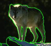
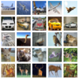
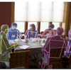
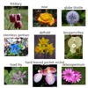
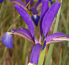
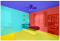
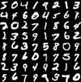
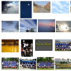

As you get familiar with Machine Learning and Neural Networks you will want to use datasets that have been provided by academia, industry, government, and even other users of Caffe2. Many of these datasets have already been trained with Caffe and/or Caffe2, so you can jump right in and start using these pre-trained models. You can also fine-tune or even do "mashups" with pre-trained models by adding additional data, models, parameters, or combinations thereof to train a new custom model for your experiments. If you think you've found something great, then don't hesitate to share! This is an Open Source project and we really hope to foster innovation and collaboration.

For further info on datasets and how to prepare them take a look at the [Models and Datasets tutorial](tutorial-models-and-datasets.html). You can also check out a [Caffe2 Python tutorial](tutorial-MNIST.html) that downloads MNIST handwriting dataset, unzips it, calls a Caffe2 provided binary that will extract/transform/load (ETL) the data into a database of key value pairs (KVPs) - in this case it uses [LevelDB](https://github.com/google/leveldb) to store the images. The tutorial goes on to show how the dataset is used to train a neural network that can be used to identify handwriting of numbers. This tutorial is [also available](https://github.com/caffe2/tutorials/blob/master/MNIST.ipynb) as a [Juypter notebook](http://caffe2.ai/docs/tutorials.html#null__tutorials-installation).

You may also want to check out the pre-trained models at [Caffe2's Model Zoo](zoo.html)! You might find examples there where these datasets have been used to train models, be able to draw from their project's open source code, and be informed of dataset-specific best practices for training models.

| Name                       | Type                        | Download                                                                                                                                                                         |
|----------------------------|-----------------------------|------------------------------------------------------------------------------------------------------------------------------------------------------------------------------|
| [AlexNet-Places205](http://places.csail.mit.edu/index.html) |  |  |
| [AN4](http://www.speech.cs.cmu.edu/databases/an4/): 948 training and 130 test utterances |  |  |
| [BSDS (300/500)](https://www2.eecs.berkeley.edu/Research/Projects/CS/vision/bsds/): 12k labeled segmentations |  | [ images](https://www2.eecs.berkeley.edu/Research/Projects/CS/vision/bsds/BSDS300-images.tgz) [ segmentations](https://www2.eecs.berkeley.edu/Research/Projects/CS/vision/bsds/BSDS300-human.tgz)                                          |
| [Celeb-A](http://mmlab.ie.cuhk.edu.hk/projects/CelebA.html): 200k+ celebrity images, 10k+ identities |  |  |
| [CIFAR-10](https://www.cs.toronto.edu/~kriz/cifar.html): 60k tiny (32x32) tagged images |  |  |
| [COCO](http://mscoco.org/dataset/): A large image dataset designed for object detection, segmentation, and caption generation. |  | 
| [CompCars](http://mmlab.ie.cuhk.edu.hk/datasets/comp_cars/index.html): 136k+ car images & 1716 car models |  |  |
| [Oxford 102 Flowers](http://www.robots.ox.ac.uk/~vgg/data/flowers/102/index.html): 102 flower categories |  | [ images](http://www.robots.ox.ac.uk/~vgg/data/flowers/102/102flowers.tgz) [ segmentations](http://www.robots.ox.ac.uk/~vgg/data/flowers/102/102segmentations.tgz) |
| [ImageNet](http://image-net.org/): 14,197,122 images, 21841 synsets indexed |  |  |
| [ImageNet ILSVRC](http://www.image-net.org/challenges/LSVRC/): Competition datasets|  |  |
| [Iris](https://en.wikipedia.org/wiki/Iris_flower_data_set) |     |  |
| [LSUN Scenes](http://lsun.cs.princeton.edu/2016/) millions of indoor/outdoor building scenes |  |  |
| [LSUN Room Layout](http://lsun.cs.princeton.edu/2016/) 4000 indoor scenes |  |  |
| [MNIST](http://yann.lecun.com/exdb/mnist/) 60k handwriting training set, 10k test images |  |  |
| [Multi-Salient-Object (MSO)](http://cs-people.bu.edu/jmzhang/sos.html) 1224 tagged salient object images |  |  |
| [OUI-Adience Face Image](http://www.openu.ac.il/home/hassner/Adience/data.html#agegender) 26,580 age & gender labeled images |  |  |
| [PASCAL VOC 2012](http://host.robots.ox.ac.uk/pascal/VOC/) 11,530 images w/ 27,450 ROI annotated objects and 6,929 segmentations|  |  |
| [PCAP](http://www.netresec.com/?page=PcapFiles) Network captures of regular internet traffic and attack scenario traffic |  |  |
| [Penn Treebank (PTB)](http://www.fit.vutbr.cz/~imikolov/rnnlm/) statistical language modeling |  | 
| [UCF11/YouTube Action](http://crcv.ucf.edu/data/UCF_YouTube_Action.php) 11 action categories: basketball shooting, biking/cycling, diving, golf swinging, horse back riding, soccer juggling, swinging, tennis swinging, trampoline jumping, volleyball spiking, and walking with a dog |  |  |
| [UCI Datasets](https://archive.ics.uci.edu/ml/datasets.html) |  |  |
| [US Census](https://catalog.data.gov/dataset): demographic data |             |  |
| [VGG-Face](http://www.robots.ox.ac.uk/~vgg/software/vgg_face/) millions of faces |  | |
| [LibriSpeech](http://www.openslr.org/12/) 1000 hours free speech recognition traning dataset|  | |
