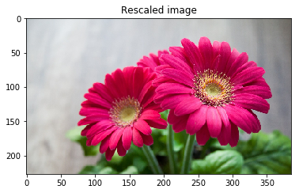
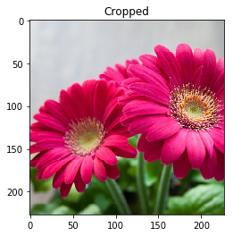
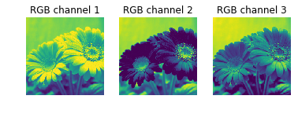

Take advantage of the [Model Zoo](https://github.com/caffe2/caffe2/wiki/Model-Zoo) and grab some pre-trained models and take them for a test drive. You can find different models that are ready to go and here we will show you the basic steps for prepping them and firing up your neural net. Then you can throw some images or other tests at them and see how they perform.

[Browse the IPython Tutorial](https://github.com/caffe2/tutorials/blob/master/Loading_Pretrained_Models.ipynb)

## Model Download Options

Check out the [Model Zoo for pre-trained models](zoo), or you can also use Caffe2's `models.download` module to acquire pre-trained models from [Github caffe2/models](http://github.com/caffe2/models)
`caffe2.python.models.download` takes in an argument for the name of the model. Check the repo for the available models' names and swap out the `squeezenet` argument if you want to try something different. Example:

```
python -m caffe2.python.models.download -i squeezenet
```

If the above download worked then you should have a copy of squeezenet in your model folder or if you used the `-i` flag it will have installed the model locally in the `/caffe2/python/models` folder.

Alternatively, you can clone the entire repo of models at `git clone https://github.com/caffe2/models` but you will need to install [Git Larg File Storage](https://git-lfs.github.com/) to download the models themselves.

## Overview

In this tutorial, we'll use the `squeezenet` model to identify objects in images.

If you came from the Image Pre-Processing Tutorial, you will see that we're using rescale and crop functions to prep the image, as well as reformatting the image to be CHW, BGR, and finally NCHW. We also correct the image mean, by either using the calculated mean from a provided npy file or statically removing 128 as a placeholder average.

You'll find that loading pre-trained model is really simple and is accomplished in just a few lines of code. Here we show those few lines:

1. read the protobuf files

        with open("init_net.pb") as f:
            init_net = f.read()
        with open("predict_net.pb") as f:
            predict_net = f.read()        

2. use the Predictor function in your workspace to load the blobs from the protobufs

        p = workspace.Predictor(init_net, predict_net)

3. run the net and get the results!

        results = p.run({'data': img})

The results come back as a multidimensional array of probabilities. Essentially each row is a percentage chance that the object matches something that the neural net recognizes. When you run the flower it should give you over 95% rating that the flower is a daisy.

## Configuration

Settings are in a code block below. Most of the time these should run out of the box.


```python
# where you installed caffe2. Probably '~/caffe2' or '~/src/caffe2'.
CAFFE2_ROOT = "~/caffe2"
# assumes being a subdirectory of caffe2
CAFFE_MODELS = "~/caffe2/caffe2/python/models"
# if you have a mean file, place it in the same dir as the model

%matplotlib inline
from caffe2.proto import caffe2_pb2
import numpy as np
import skimage.io
import skimage.transform
from matplotlib import pyplot
import os
from caffe2.python import core, workspace
import urllib2
print("Required modules imported.")
```

    Required modules imported.


The image location will pass in a URL to a photo or the location of a local file. `codes` is a list of [AlexNet object codes](https://gist.githubusercontent.com/aaronmarkham/cd3a6b6ac071eca6f7b4a6e40e6038aa/raw/9edb4038a37da6b5a44c3b5bc52e448ff09bfe5b/alexnet_codes), like "985" which equates to "daisy".

```python
IMAGE_LOCATION =  "https://cdn.pixabay.com/photo/2015/02/10/21/28/flower-631765_1280.jpg"

# What model are we using? You should have already converted or downloaded one.
# format below is the model's:
# folder, INIT_NET, predict_net, mean, input image size
# you can switch the comments on MODEL to try out different model conversions
MODEL = 'squeezenet', 'init_net.pb', 'predict_net.pb', 'ilsvrc_2012_mean.npy', 227

# codes - these help decypher the output and source from a list from AlexNet's object codes to provide an result like "tabby cat" or "lemon" depending on what's in the picture you submit to the neural network.
# The list of output codes for the AlexNet models (also squeezenet)
codes =  "https://gist.githubusercontent.com/aaronmarkham/cd3a6b6ac071eca6f7b4a6e40e6038aa/raw/9edb4038a37da6b5a44c3b5bc52e448ff09bfe5b/alexnet_codes"
print "Config set!"
```

    Config set!


In the block below we're loading the mean file (if it exists) and the image and then pre-processing the image for ingestion into a Caffe2 convolutional neural network!


```python
def crop_center(img,cropx,cropy):
    y,x,c = img.shape
    startx = x//2-(cropx//2)
    starty = y//2-(cropy//2)    
    return img[starty:starty+cropy,startx:startx+cropx]

def rescale(img, input_height, input_width):
    print("Original image shape:" + str(img.shape) + " and remember it should be in H, W, C!")
    print("Model's input shape is %dx%d") % (input_height, input_width)
    aspect = img.shape[1]/float(img.shape[0])
    print("Orginal aspect ratio: " + str(aspect))
    if(aspect>1):
        # landscape orientation - wide image
        res = int(aspect * input_height)
        imgScaled = skimage.transform.resize(img, (input_width, res))
    if(aspect<1):
        # portrait orientation - tall image
        res = int(input_width/aspect)
        imgScaled = skimage.transform.resize(img, (res, input_height))
    if(aspect == 1):
        imgScaled = skimage.transform.resize(img, (input_width, input_height))
    pyplot.figure()
    pyplot.imshow(imgScaled)
    pyplot.axis('on')
    pyplot.title('Rescaled image')
    print("New image shape:" + str(imgScaled.shape) + " in HWC")
    return imgScaled
print "Functions set."

# set paths and variables from model choice and prep image
CAFFE2_ROOT = os.path.expanduser(CAFFE2_ROOT)
CAFFE_MODELS = os.path.expanduser(CAFFE_MODELS)

# mean can be 128 or custom based on the model
# gives better results to remove the colors found in all of the training images
MEAN_FILE = os.path.join(CAFFE_MODELS, MODEL[0], MODEL[3])
if not os.path.exists(MEAN_FILE):
    mean = 128
else:
    mean = np.load(MEAN_FILE).mean(1).mean(1)
    mean = mean[:, np.newaxis, np.newaxis]
print "mean was set to: ", mean

# some models were trained with different image sizes, this helps you calibrate your image
INPUT_IMAGE_SIZE = MODEL[4]

# make sure all of the files are around...
if not os.path.exists(CAFFE2_ROOT):
    print("Houston, you may have a problem.")
INIT_NET = os.path.join(CAFFE_MODELS, MODEL[0], MODEL[1])
print 'INIT_NET = ', INIT_NET
PREDICT_NET = os.path.join(CAFFE_MODELS, MODEL[0], MODEL[2])
print 'PREDICT_NET = ', PREDICT_NET
if not os.path.exists(INIT_NET):
    print(INIT_NET + " not found!")
else:
    print "Found ", INIT_NET, "...Now looking for", PREDICT_NET
    if not os.path.exists(PREDICT_NET):
        print "Caffe model file, " + PREDICT_NET + " was not found!"
    else:
        print "All needed files found! Loading the model in the next block."

# load and transform image
img = skimage.img_as_float(skimage.io.imread(IMAGE_LOCATION)).astype(np.float32)
img = rescale(img, INPUT_IMAGE_SIZE, INPUT_IMAGE_SIZE)
img = crop_center(img, INPUT_IMAGE_SIZE, INPUT_IMAGE_SIZE)
print "After crop: " , img.shape
pyplot.figure()
pyplot.imshow(img)
pyplot.axis('on')
pyplot.title('Cropped')

# switch to CHW
img = img.swapaxes(1, 2).swapaxes(0, 1)
pyplot.figure()
for i in range(3):
    # For some reason, pyplot subplot follows Matlab's indexing
    # convention (starting with 1). Well, we'll just follow it...
    pyplot.subplot(1, 3, i+1)
    pyplot.imshow(img[i])
    pyplot.axis('off')
    pyplot.title('RGB channel %d' % (i+1))

# switch to BGR
img = img[(2, 1, 0), :, :]

# remove mean for better results
img = img * 255 - mean

# add batch size
img = img[np.newaxis, :, :, :].astype(np.float32)
print "NCHW: ", img.shape
```

    Functions set.
    mean was set to:  128
    INIT_NET =  /home/aaron/models/squeezenet/init_net.pb
    PREDICT_NET =  /home/aaron/models/squeezenet/predict_net.pb
    Found  /home/aaron/models/squeezenet/init_net.pb ...Now looking for /home/aaron/models/squeezenet/predict_net.pb
    All needed files found! Loading the model in the next block.
    Original image shape:(751, 1280, 3) and remember it should be in H, W, C!
    Model's input shape is 227x227
    Orginal aspect ratio: 1.70439414115
    New image shape:(227, 386, 3) in HWC
    After crop:  (227, 227, 3)
    NCHW:  (1, 3, 227, 227)











Now that the image is ready to be ingested by the CNN, let's open the protobufs, load them into the workspace, and run the net.


```python
# initialize the neural net

with open(INIT_NET) as f:
    init_net = f.read()
with open(PREDICT_NET) as f:
    predict_net = f.read()

p = workspace.Predictor(init_net, predict_net)

# run the net and return prediction
results = p.run({'data': img})

# turn it into something we can play with and examine which is in a multi-dimensional array
results = np.asarray(results)
print "results shape: ", results.shape
```

    results shape:  (1, 1, 1000, 1, 1)


See that we have 1000 result there in the middle? If we had submitted more than one image in our batch then the array would be larger, but still have 1000 units there in the middle. It is holding the probability for each category in the pre-trained model. So when you look at the results, it's like saying, "Computer, what's the probability that this is a Beryllium sphere?" Or gila monster, or any of the other 998 groups of things in there.

Let's see what you have! Run the next block for the result.


```python
# the rest of this is digging through the results

results = np.delete(results, 1)
index = 0
highest = 0
arr = np.empty((0,2), dtype=object)
arr[:,0] = int(10)
arr[:,1:] = float(10)
for i, r in enumerate(results):
    # imagenet index begins with 1!
    i=i+1
    arr = np.append(arr, np.array([[i,r]]), axis=0)
    if (r > highest):
        highest = r
        index = i

print index, " :: ", highest

# lookup the code and return the result
# top 3 results
# sorted(arr, key=lambda x: x[1], reverse=True)[:3]

# now we can grab the code list
response = urllib2.urlopen(codes)

# and lookup our result from the list
for line in response:
    code, result = line.partition(":")[::2]
    if (code.strip() == str(index)):
        print result.strip()[1:-2]
```

    985  ::  0.979059
    daisy


Now that you've run it, try out some different images. See how well it does across more complicated images or with multiple objects or subjects.
