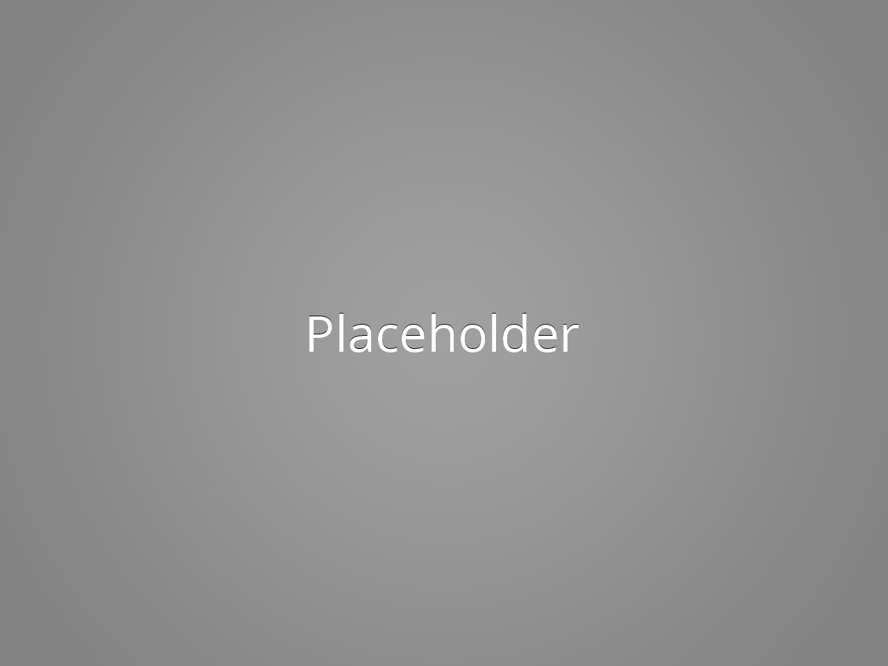

  <h3>Feature 1</h3>
  

    

      
    

    

      
    

  

  <h3>Feature 2</h3>
  

    

      
    

    

      
    

  

  <h3>Feature 3</h3>
  

    

      
    

    

      
    

  

  <h3>Feature 4</h3>
  

    

      
    

    

      
    

  

